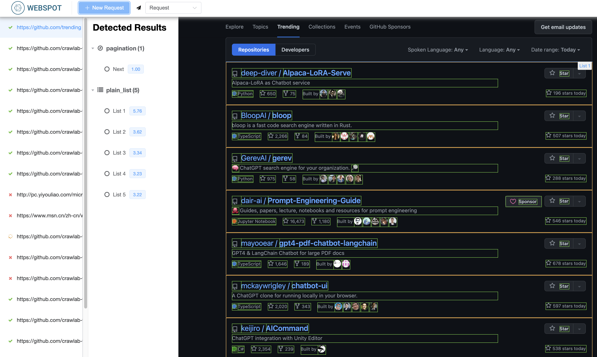
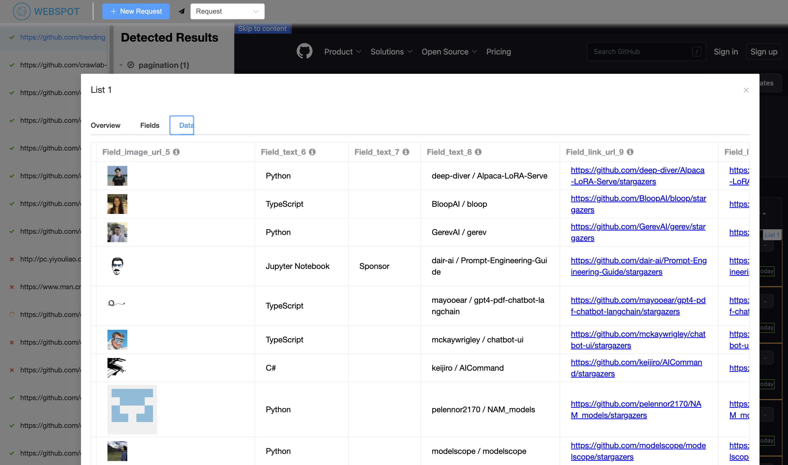

# Webspot

Webspot 是一个智能识别提取网页内容的服务。

[演示](https://webspot.crawlab.net)

[English](https://github.com/crawlab-team/webspot)

## 截图

### 识别结果



### 提取字段


### 提取数据



## 快速开始

### Docker

请保证已安装了 [Docker](https://docs.docker.com/) 和 [Docker Compose](https://docs.docker.com/compose/).

```bash
# clone git repo
git clone https://github.com/crawlab-team/webspot

# start docker containers
docker-compose up -d
```

然后你可以访问网页界面 http://localhost:9999。

## API 参考文档

启动好 Webspot 后，你可以到 http://localhost:9999/redoc 查看 API 文档.

## 架构

下图反映了 Webspot 的整体工作流程，以及相关的重要元素。


## 开发

您可以参考如下指南来开始开发。

### 环境要求

- Python >=3.8 and <=3.10
- Go 1.16 or higher
- MongoDB 4.2 or higher

### 安装依赖

```bash
# dependencies
pip install -r requirements.txt
```

### 配置环境变量

数据库配置在 `.env` 文件中。你可以拷贝示例文件并修改。

```bash
cp .env.example .env
```

### 开启 Web 服务

```bash
# start development server
python main.py web
```

### 代码结构

核心代码在 `webspot` 目录下。`main.py` 是 Web 服务的入口文件。

```
webspot
├── cmd     # command line tools
├── crawler # web crawler
├── data    # data files (html, json, etc.)
├── db      # database
├── detect  # web content detection
├── graph   # graph module
├── models  # models
├── request # request helper
├── test    # test cases
├── utils   # utilities
└── web     # web server
```

## TODOs

Webspot 旨在自动化网页内容的识别和提取。目前还处于早期阶段，还有很多功能需要实现。

- [ ] Table detection
- [ ] Nested list detection
- [ ] Export to spiders
- [ ] Advanced browser request

## Disclaimer

请遵循当地的法律法规使用 Webspot。作者不对因使用 Webspot 而引起的任何法律问题负责。请阅读 [免责声明](./DISCLAIMER-zh.md)
了解详情。

## 社区

如果你对 Webspot 感兴趣，请加作者微信账号 "tikazyq1" 并备注 "Webspot" 进入讨论群。

<p align="center">
  
</p>
