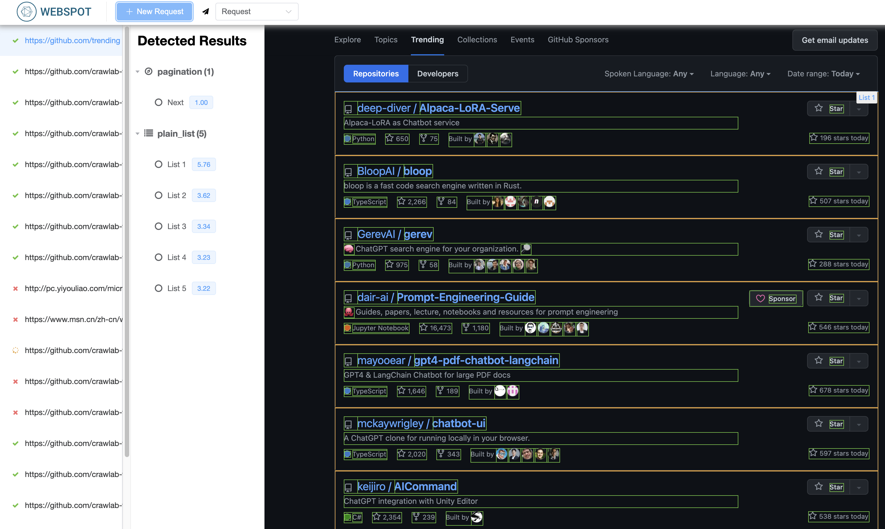
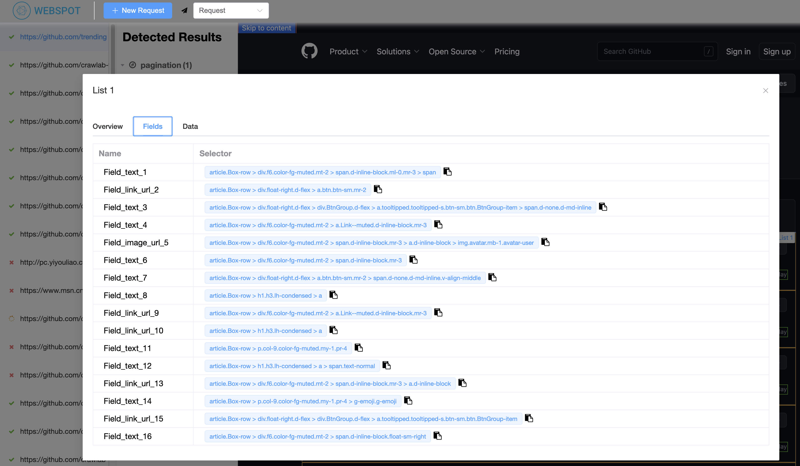
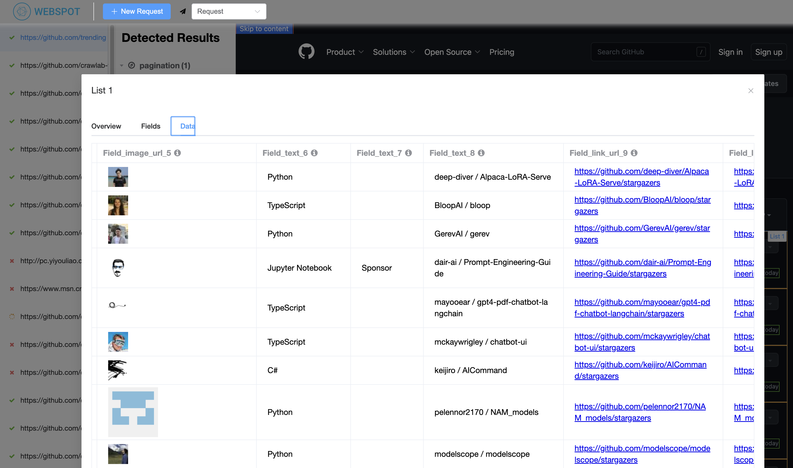
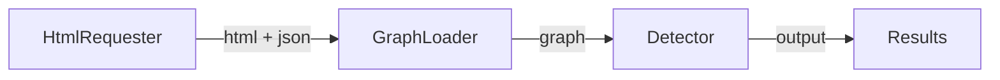

# Webspot

Webspot is an intelligent web service to automatically detect web content and extract information from it.

[Demo](https://webspot.crawlab.net)

[中文](https://github.com/crawlab-team/webspot/blob/main/README-zh.md)

## Screenshots

### Detected Results



### Extracted Fields



### Extracted Data



## Get Started

### Docker

Make sure you have installed [Docker](https://docs.docker.com/) and [Docker Compose](https://docs.docker.com/compose/).

```bash
# clone git repo
git clone https://github.com/crawlab-team/webspot

# start docker containers
docker-compose up -d
```

Then you can access the web UI at http://localhost:9999.

## API Reference

Once you started Webspot, you can go to http://localhost:9999/redoc to view the API reference.

## Architecture

The overall process of how Webspot detects meaningful elements from HTML or web pages is shown in the following figure.



## Development

You can follow the following guidance to get started.

### Pre-requisites

- Python >=3.8 and <=3.10
- Go 1.16 or higher
- MongoDB 4.2 or higher

### Install dependencies

```bash
# dependencies
pip install -r requirements.txt
```

### Configure Environment Variables

Database configuration is located in `.env` file. You can copy the example file and modify it.

```bash
cp .env.example .env
```

### Start web server

```bash
# start development server
python main.py web
```

### Code Structure

The core code is located in `webspot` directory. The `main.py` file is the entry point of the web server.

```
webspot
├── cmd     # command line tools
├── crawler # web crawler
├── data    # data files (html, json, etc.)
├── db      # database
├── detect  # web content detection
├── graph   # graph module
├── models  # models
├── request # request helper
├── test    # test cases
├── utils   # utilities
└── web     # web server
```

## TODOs

Webspot is aimed at automating the process of web content detection and extraction. It is far from ready for production
use. The following features are planned to be implemented in the future.

- [ ] Table detection
- [ ] Nested list detection
- [ ] Export to spiders
- [ ] Advanced browser request

## Disclaimer

Please follow the local laws and regulations when using Webspot. The author is not responsible for any legal issues
caused by. Please read the [Disclaimer](./DISCLAIMER.md) for details.

## Community

If you are interested in Webspot, please add the author's WeChat account "tikazyq1" noting "Webspot" to enter the
discussion group.

<p align="center">
  
</p>
